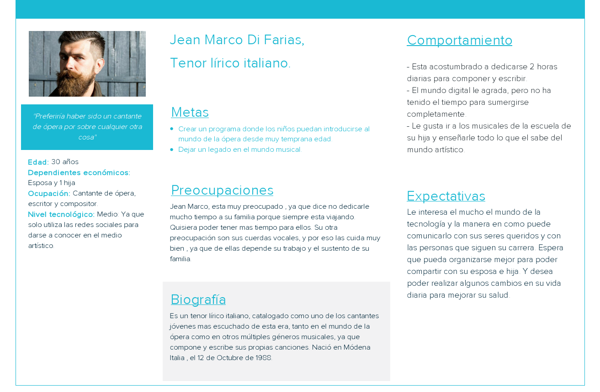

# operaguy-up

### User Persona de un cantante de Ópera

### Descripción del proceso
 
* Se investigo a profundidad al usuario.
* Se le obtuvo su infomación básica como su nombre, edad , ocupación y porsupuesto nivel tecnologico.
* Se le pregunto cuales son sus metas a largo, mediano o corto plazo.
* Sus preocupaciones tanto a nivel profesional como personal.
* Basandonos en las entrevistas realizadas, se pudo indagar acerca por sus respuesta y su lenguaje corporal puntos sensibles acerca de como es su comportamiento.
* Se le pregunto acerca de sus expectativas mas fuertes.

Gracias a que nos proporcionó toda la infomación requerida, se logró la realiación del User Persona que nos permitirá definir estrategias, saber cómo establecer comunicación para poder darle valor al negocio. 

 

